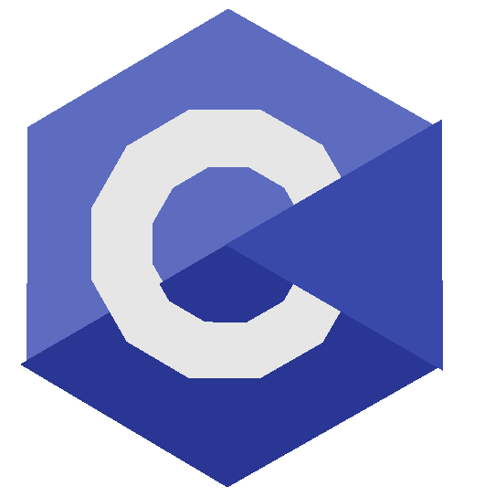
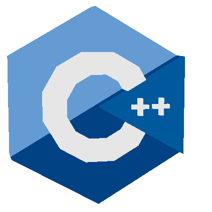
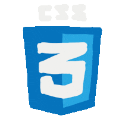

<h1 align="center">Hi 👋, I'm SOAMYARANJAN BISWAL</h1>
<h3 align="center">👋 Hi there! I'm A 🎓 MCA Student | Aspiring Software Developer</h3>

  

- 🌱 I’m currently learning **Java,AWS,Sql**

- 🤝 I’m looking for help with **Advance Java**

- 👨‍💻 All of my projects are available at   https://soumya.freewebhostmost.com/

- 💬 Ask me about **C, C++**

- 📫 How to reach me   **biswalsoumya342@gmail.com**

- ⚡ Fun fact **I Think I Am Funny**

- 🐝 Wanna Be A **BummbleBee**

<h3 align="left">Connect with me:</h3>

  

  

<h3 align="left">Languages and Tools: </h3>

           

 

